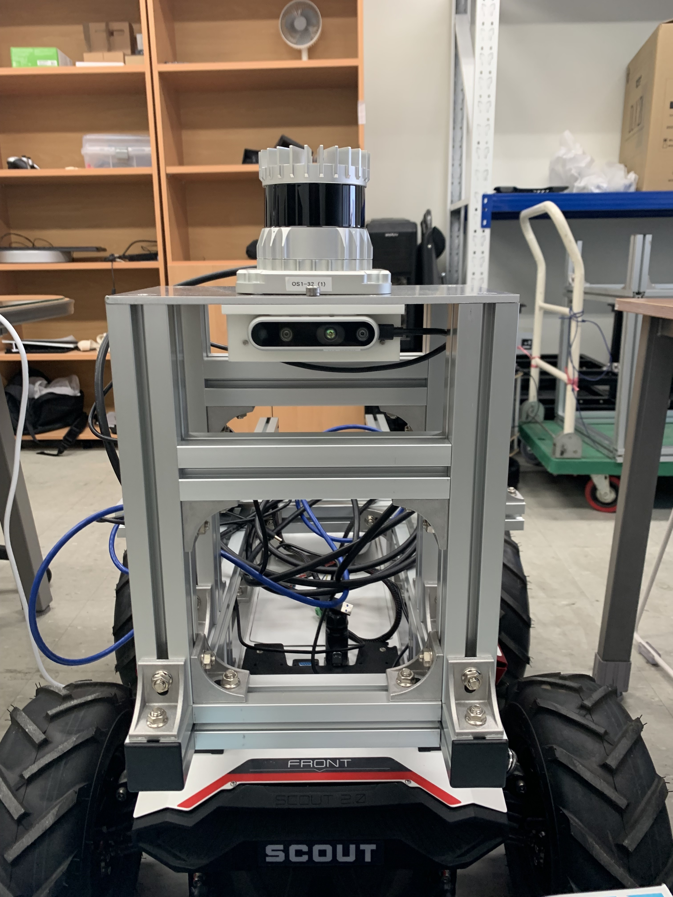
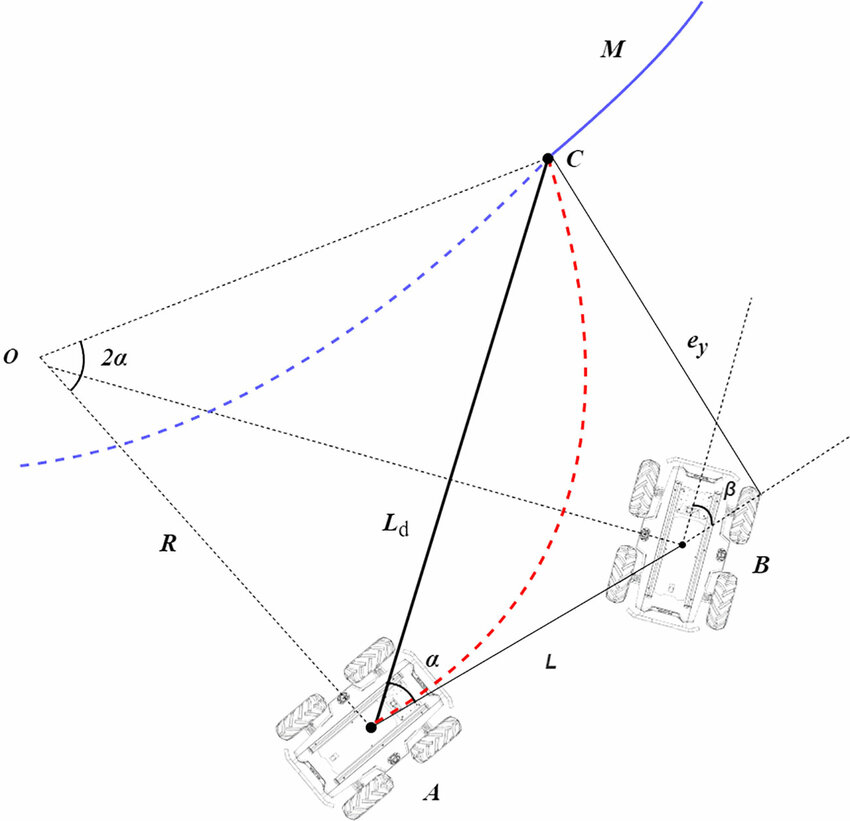
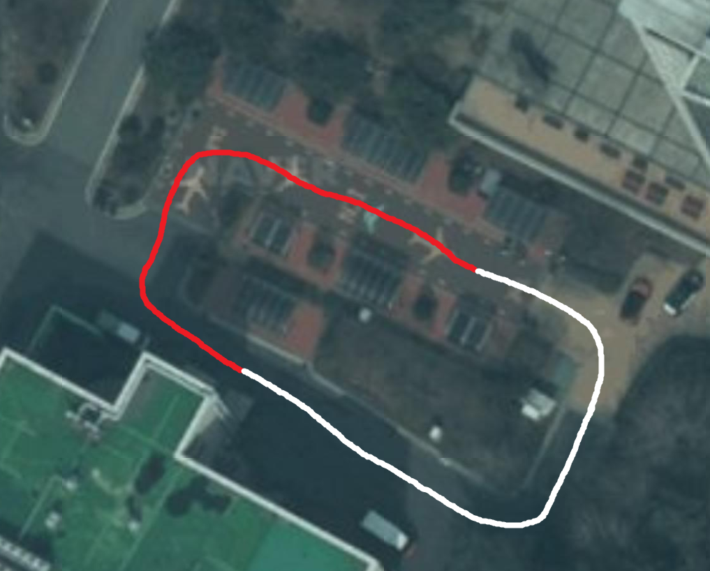

  
# 🚀 SCOUT 2.0 Navigation 
---

This package is a code that follows a waypoint-based global path for Scout 2.0. It performed path tracking based on the pure pursuit algorithm and PID steering angle control.


<br/><br/>

## **Prerequisites**
---
- LiDAR localization [**Fast Localization**](https://github.com/hwan0806/FAST-LOCALIZATION)
  - pcd data(submap) [**data**](https://drive.google.com/file/d/1uJNYgAl9EpmnVGMoPCPvhDYSY3XAQz-t/view?usp=sharing)
  
- [**scout package**](https://github.com/agilexrobotics/scout_ros)
- [**ugv_sdk**](https://github.com/westonrobot/ugv_sdk)

<br/><br/>

## **Sensors**
---
- Ouster 64ch 
<p align="center">


## **Updates**
---
[**scout_nav**](https://github.com/jiyuninha/nav_pkg_stanley) based on stanley method. This package will be updated continuously. 
[**nav_pkg**]()is document. This document will be updated continuously.

<br/><br/>

## **Introduce**
---
<p align="center">
<br/><br/>
- Pure Pursuit
  The pure persuit algorithm is a path tracking algorithm. This algorithm follows a reference path using only the vehicle's kinetic equation and the geometry of the reference path. It calculates the steering angle that can reach the target point in front of it from the current position of the scout. The linear velocity was commanded at a constant value of 0.8 m/s. The scout constantly follows to a target point in front. The shorter the Lookahead distance, the more likely it is to vibrate along the path. The vehicle gives a long lookahead, but the scout is small at 0.8 m/s, so it gives it 3.5 m so that it does not spin early.
- PID
  The PID control algorithms are proportional, integral, and differential control. The measured value is gradually updated to a value proportional to the set value, and the measured value and the set value become the same. PI control has poor responsiveness to disturbances, so D differential control greatly controls disturbances.


## **Development Environment Setup**
---
- ROS noetic, ubuntu20.04

<br/>
<br/>

1. installation for scout 
```
mkdir scout_ws/src && cd scout_ws/src
catkin_init_workspace
git clone https://github.com/jiyuninha/nav_pkg.git
git clone https://github.com/westonrobot/ugv_sdk.git
git clone https://github.com/agilexrobotics/scout_ros.git
cd ~/scout_ws
catkin_make

```

2. installation for LiDAR localization
```
mkdir loc/src && cd loc/src
catkin_init_workspace
git clone https://github.com/ouster-lidar/ouster-ros.git
git clone https://github.com/hwan0806/FAST-LOCALIZATION.git
cd ~/loc 
catkin_make
```

3. first terminar
```
cd ~/loc
source devel/setup.bash
roslaunch ouster-ros sensor.launch
```
4. second terminar
```
cd ~/loc 
source devel/setup.bash
roslaunch fast_localization localization_ouster64.launch
```
5. third terminar
```
cd ~/scout_ws 
source devel/setup.bash
roscd scour_bringup 
cd scripts 
./bringup_can2usb.bash
cd ..
cd launch 
roslaunch scout_robot_base.launch
```
5. fourth terminar
```
cd ~/scout_ws
source devel/setup.bash
roslaunch nav_pkg nav.launch
```

<br/><br/>

## **Result and Video**
---
<p align="center">
<br/><br/>

- [**Scout Navigation**](https://youtu.be/myETR4duN9g)

